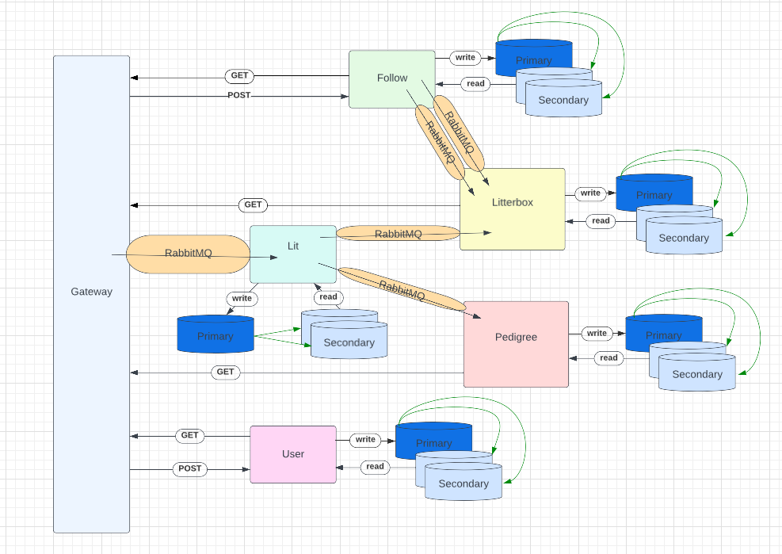
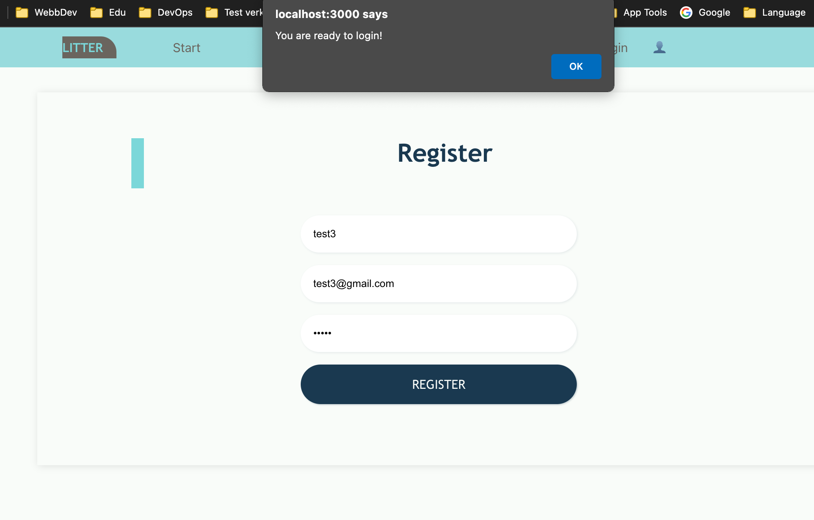
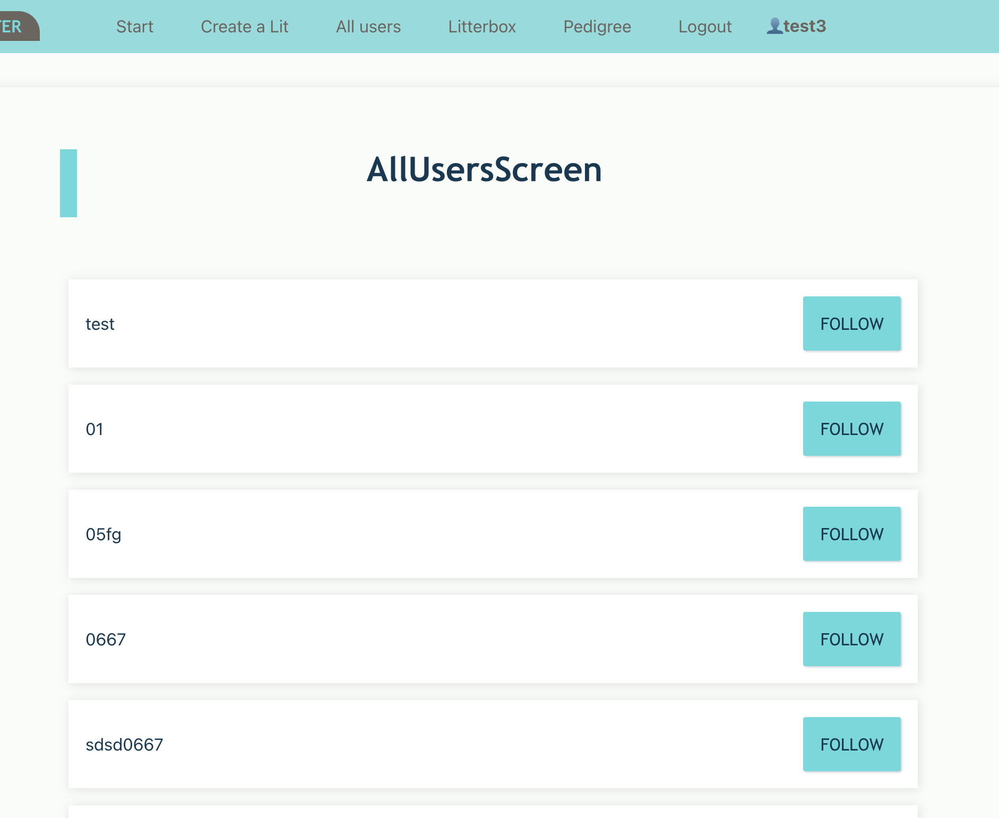
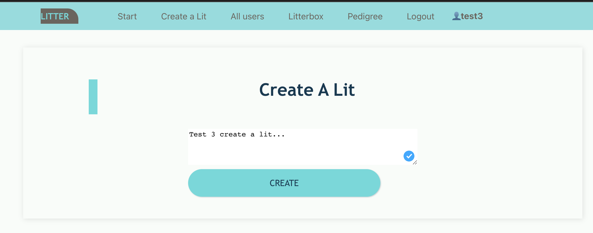

# Social media platform
 * Kubernetes
 * React 
 * MongoDB
 * Terraform
 * Microservices for following users, posts, authentication etc.
 * RabbitMq implementing the asynchronous single-receiver pattern
 * Testing using Mocha and Chai.
 * Gateway, load balacing and DB scaling/replication.
 * Authentication
 * Staging and production environment using CI/CD, automatic testing/build pipelines.  
## DESIGN

## Screenshots

### Local
How RabbitMQ and MongoDB are required to be setup differetiate a little bit.
For example:
helm install kanin --set auth.password=[PASSWORD] my-repo/rabbitmq

helm install mongo --set auth.rootPassword=[PASSWORD],auth.username=[USERNAME],auth.password=[PASSWORD],auth.database=my-database,replicaSet=enabled,architecture=replicaset my-repo/mongodb

### Production
For production:
  1. helm repo add my-repo https://charts.bitnami.com/bitnami

  2. helm install mongo --set auth.rootPassword=[PASSWORD],auth.username=[USERNAME],auth.password=[PASSWORD],auth.database=my-database,replicaSet=enabled,architecture=replicaset,volumePermissions.enabled=true,master.persistence.existingClaim=datadir-mongo-mongodb-0,master.persistence.existingClaim=datadir-mongo-mongodb-1 my-repo/mongodb

  3. Make sure all pods is "Running" before execution "helm install kanin".

  4. helm install kanin --set auth.password=[PASSWORD],volumePermissions.enabled=true,master.persistence.existingClaim=data-kanin-rabbitmq-0 my-repo/rabbitmq

#### Troubleshooting
Useful commands if application not working correctly in production:  
    Run staging exec first then commands:  
    kubectl delete pvc --all  
    kubectl delete pv --all  
    kubectl delete pods --all  
    (i usually run staging/produktion deploy first and then helm install's above). Sometimes the rabbitMQ pv/pvc's needs to be deleted before running "helm install" because of permission conflicts.

When upgrading or deleting RabbitMQ or deleting the rabbitmq-volume(PV) the credentials will get lost to easily fix this run:  
kubectl exec --stdin --tty kanin-rabbitmq-0 -- /bin/bash  
rabbitmqctl change_password user RABBITMQ_PASSWORD  
Delete(restart) affected pods using kubectl delete pod PODNAME  
More: https://docs.bitnami.com/general/how-to/troubleshoot-helm-chart-issues/  #credential-errors-while-upgrading-chart-releases

### Testing
The test suite uses Mocha and Chai as the assertion library.
Each service has a simple test while the gateway is responisble for running all the connectivity tests for the services.

The connectivity tests need to be ran after "skaffold dev" and the services has been configured.
Command: kubectl exec --stdin --tty gateway-[POD] -- npm run test

The react frontend-tests can be run with "npm run test".

### Miscellaneous
When deploying it's sometimes useful(and required) to restart the pods to update the React frontend to reflect the new changes:
kubectl delete pods --all